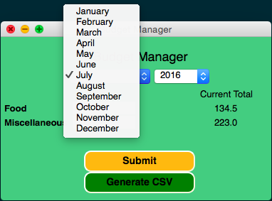
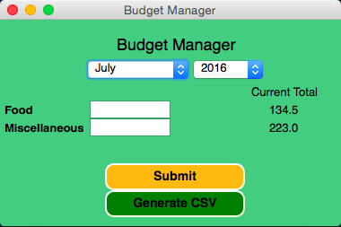

Budget Manager
==============

An application that keeps track of your budget (expenses).

Installation
------------
```sh
# Development with alias mode (-A flag)
# Alias mode (the -A or --alias option) instructs py2app to build an application bundle that uses your source and data files in-place. It does not create standalone applications, and the applications built in alias mode are not portable to other machines
$ python setup.py py2app -A

# To run application directly from the Terminal
$ ./dist/BudgetManager.app/Contents/MacOS/BudgetManager

# Building for deployment
# This will assemble your application as dist/BudgetManager.app. Since this application is self-contained, you will have to run the py2app command again any time you change any source code, data files, options, etc.
# The easiest way to wrap your application up for distribution at this point is simply to right-click the application from Finder and choose “Create Archive”.
$ python setup.py py2app

# Copy the application (.app) bundle to Applications directory
$ sudo cp -r dist/BudgetManager.app /Applications/

# NOTE: Useful link: https://pythonhosted.org/py2app/tutorial.html
```

Usage
-----
Just start the application as you would start any other application on your Mac. Go to the Applications directory and click on the icon or you can make the shortcut on your Dock.

Screenshot
----------



Author
------
Deep Aggarwal  
deep.uiuc@gmail.com  
Date Started: 03/27/2016  
